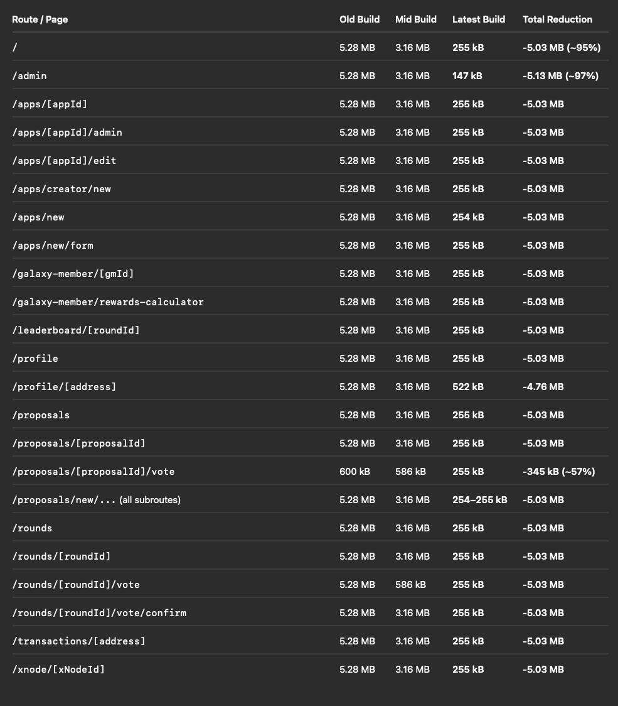

# How Ditching Barrel Files Reduced My Bundle Size by 95%

A few weeks ago, while analyzing one of my dApp projects, I stumbled upon something that completely changed how I think about **barrel files**.

What started as a small optimization experiment turned into a **massive performance boost** — bundle sizes dropped from over 5 MB down to just ~250 KB per route.

Here’s the breakdown 👇

---

## The Discovery

It started with curiosity.  
The app was running fine, but builds felt slow and the final bundles seemed too large for the actual codebase.

So I cracked open the **Next.js bundle analyzer** to see what was going on.

- 📘 [Next.js Local Development Guide](https://nextjs.org/docs/app/guides/local-development)
- 🧩 [Atlassian: Faster builds when removing barrel files](https://www.atlassian.com/blog/atlassian-engineering/faster-builds-when-removing-barrel-files)

Those two articles were eye-opening.  
They explained how **barrel files** — the handy `index.ts` files that re-export modules — can actually _hurt_ tree-shaking and cause the bundler to include entire modules unnecessarily.

After realizing this, I decided to test the impact by removing barrel file imports from a few internal packages that contained ABIs, contract JSONs, and utility code.

---

## What Are Barrel Files (and Why They Hurt)

A _barrel file_ is a convenience pattern that gathers and re-exports modules.

For example:

```ts
// index.ts
export * from "./Button";
export * from "./Card";
export * from "./Modal";
```

This looks tidy at first glance — you can import everything from a single entry point:

```ts
import { Button, Card } from "@/components";
```

But there’s a hidden cost.  
When the bundler (like Webpack or Vite) sees this structure, it often can’t determine which exports are actually used — so it keeps them all.

That means even if you only import one function, **the entire module tree** gets included in your bundle.

---

## The Experiment

After identifying a few heavy offenders in my codebase, I decided to remove all barrel file imports and replace them with **direct imports**.

Instead of:

```ts
import { Wallet, Contract } from "@/lib/core";
```

I switched to:

```ts
import { Wallet } from "@/lib/core/wallet";
import { Contract } from "@/lib/core/contract";
```

Then I built the app again and compared snapshots using the bundle analyzer.

---

## The Results

The results were staggering.

In short, every single route saw a **90–97% reduction in bundle size**.  
From ~5 MB per page down to ~250 KB — all by just removing barrel imports.



That’s a huge win for both performance and developer experience — smaller builds mean faster deploys and lighter pages for users.

---

## Visualizing the Impact

To understand what was still taking up space, I dug deeper with the **bundle heatmap**.  
It helped visualize which modules were still contributing most to the bundle size — in my case, a few large contract factory files and generated ABIs.

Even after optimizing, there were still opportunities for improvement — like modularizing ABI exports or lazily loading contract definitions.

---

## Takeaways

If you’re maintaining a modern web app, SDK, or library, here are a few lessons learned from this experience:

1. **Avoid barrel files** — especially in shared libraries or packages.  
   They make code look cleaner but can silently destroy tree-shaking.

2. **Measure, don’t guess.**  
   Tools like `@next/bundle-analyzer` or `webpack-bundle-analyzer` give you concrete insight into what’s bloating your builds.

3. **Be careful with JSON and ABI exports.**  
   Large contract or data exports can dominate bundle size if not modularized.

4. **Prefer explicit imports.**  
   They might look verbose, but they give bundlers the clarity they need to exclude unused code.

---

## Final Thoughts

Sometimes, the biggest performance bottlenecks come from the smallest patterns.  
A single `index.ts` file may seem harmless, but it can quietly add megabytes to your production build.

After this experiment, I’ve started avoiding barrel files entirely — especially in libraries.  
The result? Smaller bundles, faster builds, and happier users.

---

### 🧠 Pro Tip

If you’re curious whether your app is affected, install the Next.js Bundle Analyzer and take a look.  
You might be surprised by what’s hiding inside your build.
