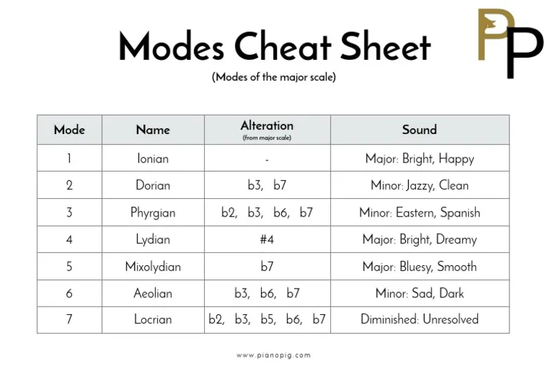

# Modes

Let's see what are these modes they're talking about and what are those made of!

Spoiler here: They are just `Diatonic Major Scale` with some rearrangement of its intervals.

## Formulas

Think of Major scale, all scales are derived from major scale.
Modes are just the reordering of the intervals of major scale.

For instance,for Dorian,start from the second and end on the first one like below.

| Formulas       | I   | ii    | iii   | IV    | V     | vi    | vii(o) | I     |
| -------------- | --- | ----- | ----- | ----- | ----- | ----- | ------ | ----- |
| Major (Ionian) | R   | Whole | Whole | Half  | Whole | Whole | Whole  | Half  |
| Dorian         | R   | Whole | Half  | Whole | Whole | Whole | Half   | Whole |

---

## Intervals

Instead of using Whole and Half, I find learning intervals to get the big
picture and in guitar, it makes it easier to construct scales after learning
possible interval shapes.

| Intervals           | I   | ii  | iii | IV    | V     | vi  | vii(o) | I      |
| ------------------- | --- | --- | --- | ----- | ----- | --- | ------ | ------ |
| Ionian(Major)       | R   | M2  | M3  | P4    | P5    | M6  | M7     | Octave |
| Dorian              | R   | M2  | m3  | P4    | P5    | M6  | m7     | Octave |
| Phrygian            | R   | m2  | m3  | P4    | P5    | m6  | m7     | Octave |
| Lydian              | R   | M2  | M3  | TT/b4 | P5    | M6  | M7     | Octave |
| Mixolydian          | R   | M2  | M3  | P4    | P5    | M6  | m7     | Octave |
| Aeolian(Rel. minor) | R   | M2  | m3  | P4    | P5    | m6  | m7     | Octave |
| Locrian             | R   | m2  | m3  | P4    | TT/b5 | m6  | m7     | Octave |

When you analyze the modes you can easily see why in a major scale

- I IV V chords are major chords
  > V is actually dominant, that's why most progressions return to tonic(I) after dominant(V).
- ii, iii, vi are minor chords and the vii is half diminished
  > which is also described as **m7b5** chord, cause it has **m7** and **b5** in it.

Another use case we can deduct from the table is

- With Major7 chords play Ionian or Lydian
- With Minor7 chords play Dorian, Phrygian or Aeolian
- With Dominant7 chords play Mixolydian
- With Min7b5 chords play Locrian (Ditch it for now)
  > Locrian is the problem child, it is incredibly rarely used in music.

---

## Modes of C as an example

| Modes of C   | I   | ii  | iii | IV  | V   | vi  | vii(o) | I   |
| ------------ | --- | --- | --- | --- | --- | --- | ------ | --- |
| C Ionian     | C   | D   | E   | F   | G   | A   | B      | C   |
| C Dorian     | C   | D   | Eb  | F   | G   | A   | Bb     | C   |
| C Phrygian   | C   | Db  | Eb  | F   | G   | Ab  | Bb     | C   |
| C Lydian     | C   | D   | E   | F#  | G   | A   | B      | C   |
| C Mixolydian | C   | D   | E   | F   | G   | A   | Bb     | C   |
| C Aeolian    | C   | D   | Eb  | F   | G   | Ab  | Bb     | C   |
| C Locrian    | C   | Db  | Eb  | F   | Gb  | Ab  | Bb     | C   |

---

## Notes to emphasize

Since modes are just minor or major diatonic scales with slight tweaks,
to make sure to give the feeling, **the tweaked notes** should be emphasized playing.

### Dorian (minor scale)

Dorian mode is just a `minor` scale but raised sixth by half,
which also means using **M6** instead of **m6** interval.
So, it is good to emphasize **M6** playing `Dorian`
to make sure it sound Dorian instead of a regular minor scale, or Aeolian in
this case.

| Intervals           | I   | ii  | iii | IV  | V   | vi   | vii(o) | I      |
| ------------------- | --- | --- | --- | --- | --- | ---- | ------ | ------ |
| Dorian              | R   | M2  | m3  | P4  | P5  | `M6` | m7     | Octave |
| Aeolian(Rel. minor) | R   | M2  | m3  | P4  | P5  | `m6` | m7     | Octave |

---

### Phrygian (minor scale)

Phrygian mode is just a `minor` scale but lower 2nd by half,
which also means using **M2** instead of **m2** interval.
So, it is good to emphasize **M2** playing `Phrygian`
to make sure it sound Dorian instead of a regular minor scale, or Aeolian in
this case.

| Intervals           | I   | ii   | iii | IV  | V   | vi  | vii(o) | I      |
| ------------------- | --- | ---- | --- | --- | --- | --- | ------ | ------ |
| Phrygian            | R   | `m2` | m3  | P4  | P5  | m6  | m7     | Octave |
| Aeolian(Rel. minor) | R   | `M2` | m3  | P4  | P5  | m6  | m7     | Octave |

---

### Lydian (major scale)

Lydian mode is just a `major` scale but lower 4th by half,
which also means using **b4** instead of **p4** interval.
So, it is good to emphasize **b4** playing `Lydian`
to make sure it sound Dorian instead of a regular major scale, or Ionian in
this case.

| Intervals     | I   | ii  | iii | IV      | V   | vi  | vii(o) | I      |
| ------------- | --- | --- | --- | ------- | --- | --- | ------ | ------ |
| Ionian(Major) | R   | M2  | M3  | `P4`    | P5  | M6  | M7     | Octave |
| Lydian        | R   | M2  | M3  | `TT/b4` | P5  | M6  | M7     | Octave |

---

### Mixolydian (major dominant scale)

Mixolydian mode is just a `major` scale but lower 7th by half,
which also means using **M7** instead of **m7** interval.
So, it is good to emphasize **m7** playing `Mixolydian`
to make sure it sound Dorian instead of a regular major scale, or Ionian in
this case.

| Intervals     | I   | ii  | iii | IV  | V   | vi  | vii(o) | I      |
| ------------- | --- | --- | --- | --- | --- | --- | ------ | ------ |
| Ionian(Major) | R   | M2  | M3  | P4  | P5  | M6  | `M7`   | Octave |
| Mixolydian    | R   | M2  | M3  | P4  | P5  | M6  | `m7`   | Octave |

---

### Aeolian (natural minor scale)

Aeolian mode is the natural minor scale itself for the root note.
Just look how guide notes replaced with minors instead of majors.
iii and vii are called as guide notes, but also be aware of the vi notes is
also using minor. So we can say, except I, IV and V all notes are using minor
intervals, that's why it is called minor scale in the end.

| Intervals           | I   | ii  | iii | IV  | V   | vi  | vii(o) | I      |
| ------------------- | --- | --- | --- | --- | --- | --- | ------ | ------ |
| Ionian(Major)       | R   | M2  | M3  | P4  | P5  | M6  | M7     | Octave |
| Aeolian(Rel. minor) | R   | M2  | m3  | P4  | P5  | m6  | m7     | Octave |

---

## Minor Scales

There are three primary minor scale namely, natural, which we already know as
Aeolian, harmonic minor and melodic minor. Look how melodic and harmonic minor
derived from major scale. This is the point which i understand more every
possible scale is derived from major scale.

| Intervals     | I   | ii  | iii  | IV  | V   | vi   | vii(o) | I      |
| ------------- | --- | --- | ---- | --- | --- | ---- | ------ | ------ |
| Ionian(Major) | R   | M2  | M3   | P4  | P5  | M6   | M7     | Octave |
| Melodic       | R   | M2  | `m3` | P4  | P5  | M6   | M7     | Octave |
| Harmonic      | R   | M2  | `m3` | P4  | P5  | `m6` | M7     | Octave |

I also put Dorian below there cause they are so close to each other.
Since each scale has its modes inside, Harmonic and
Melodic minor has modes itself to be discovered later on.

| Intervals          | I   | ii  | iii | IV  | V   | vi   | vii(o) | I      |
| ------------------ | --- | --- | --- | --- | --- | ---- | ------ | ------ |
| Natural(Aeolian)   | R   | M2  | m3  | P4  | P5  | m6   | m7     | Octave |
| Harmonic(Yngwie )  | R   | M2  | m3  | P4  | P5  | m6   | `M7`   | Octave |
| Melodic(Jazz)      | R   | M2  | m3  | P4  | P5  | `M6` | `M7`   | Octave |
| Dorian(Funk/Blues) | R   | M2  | m3  | P4  | P5  | `M6` | m7     | Octave |

I think I got too far before learning basics in this post. So, I will stop here with the modes and go back to basic in my next post.
Anyway, It made me happy to see the structure and understand how modes are made up. At the end, what I can say is The Diatonic Major Scale is the one to rule them all!

---

### TLDR; Practical Modes Summary

Instead of memorizing every mode from scratch, I find it much more practical to think of modes as **small alterations of familiar major or minor scales**.
This makes it easier to recognize them on the fretboard and apply them musically.

### Major-Based Modes

- **Ionian (Major)**  
  Just the regular major scale. No changes.

- **Lydian**  
  Major scale with a **raised 4th**  
  → Think: _major + ♯4_

- **Mixolydian**  
  Major scale with a **lowered 7th**  
  → Think: _major + ♭7_

---

### Minor-Based Modes

- **Aeolian (Natural Minor)**  
  The standard minor scale. No changes.

- **Dorian**  
  Minor scale with a **raised 6th**  
  → Think: _minor + M6_

- **Phrygian**  
  Minor scale with a **lowered 2nd**  
  → Think: _minor + ♭2_

---

### The Problem Child

- **Locrian**  
  Minor scale with a **lowered 2nd and lowered 5th**  
  → Think: _minor + ♭2 + ♭5_  
  (Very unstable and rarely used—safe to ignore for now.)

---

_Modes Cheat Sheet_

This way of thinking helped me stop treating modes as something mysterious.  
They’re not new scales—they’re **small twists on scales we already know**.
