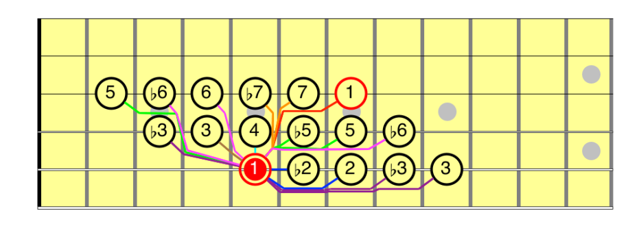
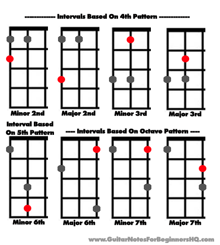
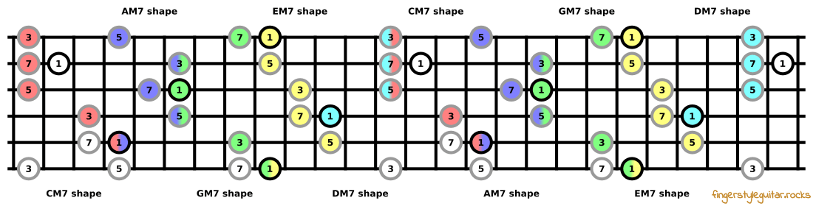

In my honest opinion, if there is one thing everyone should learn to
truly understand music, intervals are the first place to look.

Since I started learning music theory, my perspective on music has shifted completely.
It used to be just a "magic tool" to entertain the brain—something to fill the silence.
It was like salt: you add it to something you don't like just to make it bearable.
Running with music, cleaning the house with music, shopping with music.
The best friend you can have, right?

I still feel that way for the most part, but now I also see it as a tool for "hacking"
our brain—triggering biochemicals to regulate or control our emotions. That’s why it
can turn something incredibly boring into something alive.

There’s a famous quote by Gottfried Leibniz that I absolutely adore:

> Music is the pleasure the human mind experiences from counting
> without being aware that it is counting.

From my perspective today—now that I know a bit of the basics—music is essentially
a game of tension and resolution. Intervals are the most fundamental way to achieve
that. Our brains find certain intervals "beautiful" and others... Not so much.
Some feel stressful, some dark and emotional, some cheerful, and some sound
"Middle Eastern" or "Arabesque" depending on your cultural conditioning.

Putting the philosophy aside, here is how intervals are named based on their
semitone distance:

- Root
- minor 2nd
- Major 2nd
- minor 3rd
- Major 3rd
- Perfect 4th
- Tritone
- Perfect 5th
- minor 6th
- Major 6th
- minor 7th
- Major 7th
- Octave

I think you get why it is called minor and major,

- if semitone(half) apart, minor
- if tone(whole) apart, major

But, if you ask why "Perfect", I think the answer is in the mathematics:
It is the ratio of the frequencies. The formula of finding frequencies of an
interval divided into 12 equal semitones is:

$$
\begin{equation}
  f_n = f_0 * 2^{n/12}
\end{equation}
$$

$$
\begin{equation}
  2^{(12/12)} = 2^{1} = \mathbf{2}
\end{equation}
$$

$$
\begin{equation}
   2^{(7/12)} \approx \mathbf{1.4983}
\end{equation}
$$

$$
\begin{equation}
   2^{(5/12)} \approx \mathbf{1.3333}
\end{equation}
$$



| Interval    | Freq. Ratio |
| ----------- | ----------- |
| Unison      | 1:1         |
| Octave      | 2:1         |
| Perfect 5th | 3:2         |
| Perfect 4th | 4:3         |

So, they are almost perfect in terms of frequency and that's why sound
good/perfect. If you want to learn more about this, here is a video about the
famous mathematician who broke the music, Pythagoras.



## How to find intervals in guitar

Finding intervals on the fretboard is actually quite logical once you memorize the shapes.
Since we know guitar strings are tuned 5 semitones apart (except for that tricky B
string which is 4 semitones from G), the patterns repeat.

If you’ve ever played a power chord, you already know where the Perfect 5th is.
A power chord is literally just: Root + 5th (+ Octave).

A power chord
: 5-7-7-X-X-X (on E, A, D strings)

E power chord
: X-7-9-9-X-X (on A, D, G strings)

_All intervals displayed on fretboard_

_Best way to learn intervals with 4th, 5th and octave pattern_

## Building chords with intervals

So lets build some triads using these intervals together.

- major chords, Root + M3 + P5
- dominant 7 chords, Root + M3 + P5 + m7
- major 7 chords, Root + M3 + P5 + M7
- minor chords, Root + m3 + P5
- minor 7 chords, Root + m3 + P5 + m7
- half diminished chords(also called m7b5), Root + m3 + b5 + m7
- diminished chord, Root + m3 + b5 + bb7
- augmented chords,(also called #5), Root + m3 + #5

_This image shows us major 7ths with CAGED system is a good reference point_

Practicing these triads with a metronome has been a game changer for me.
It’s helping me in three specific ways:

1. Drastically increasing my fretboard knowledge.
2. Allowing me to build complex chords on the fly.
3. Subconsciously building scale knowledge without even noticing it.
